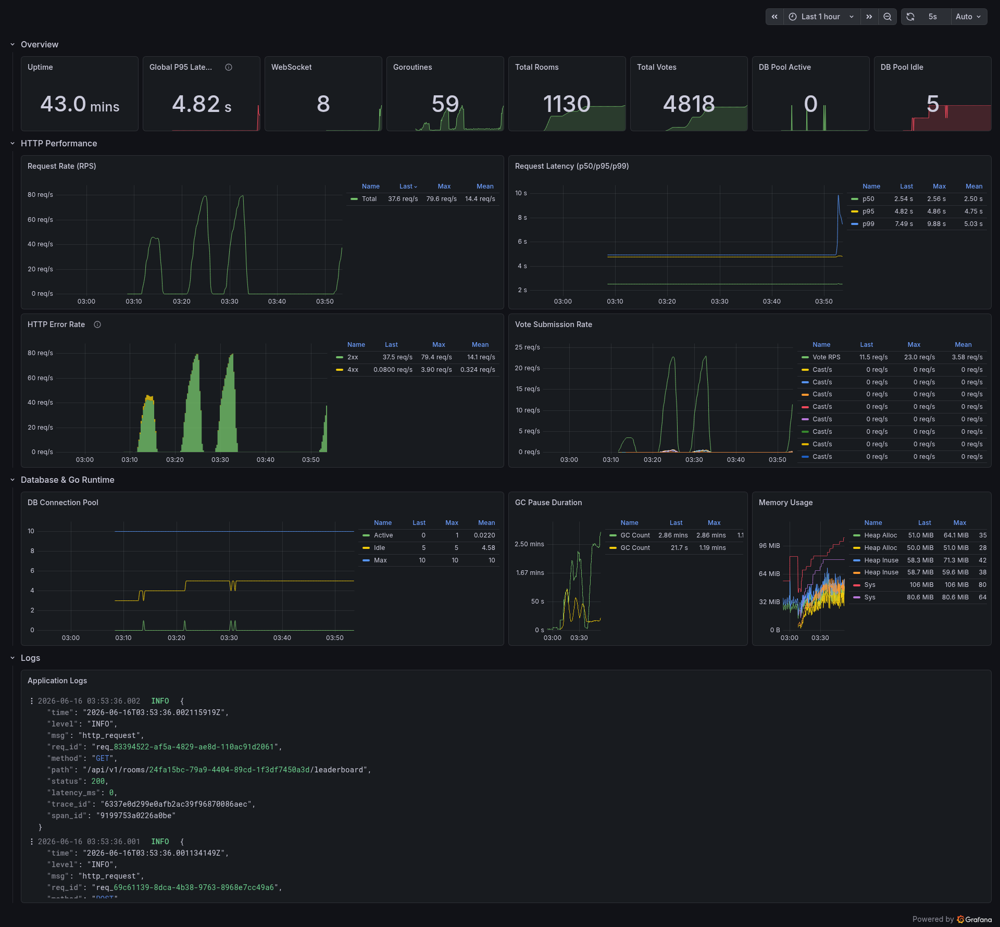

# VoteSystem

Real-time voting platform built with Go, PostgreSQL, and Redis. Supports single-choice and multiple-choice rooms with live WebSocket updates, file uploads via MinIO, and full observability via OpenTelemetry, Grafana, Prometheus, Loki, and Tempo.

## Tech Stack

- **Language:** Go 1.26
- **HTTP Framework:** Gin
- **Database:** PostgreSQL 16 (via pgx v5)
- **Cache & Leaderboard:** Redis 7 (sorted sets)
- **File Storage:** MinIO (S3-compatible)
- **Real-time:** Gorilla WebSocket
- **Observability:** OpenTelemetry, Grafana, Prometheus, Loki, Tempo
- **Load Testing:** k6
- **Containerization:** Docker + Docker Compose

## Prerequisites

- Go 1.26+ (local development)
- Docker & Docker Compose (full stack with observability)
- Task (optional, for common commands - install via `go install github.com/go-task/task/v3/cmd/task@latest`)

## Quick Start

### Local Development

```bash
# 1. Copy and configure environment
cp .env.example .env
# Edit .env as needed (defaults work for local Postgres/Redis)

# 2. Run dependencies (Postgres, Redis, MinIO)
docker compose up -d postgres redis minio

# 3. Run the application
go run ./cmd/api
```

The API will be available at `http://localhost:8080`. Migrations run automatically on startup.

### Full Stack with Docker

```bash
# 1. Copy Docker environment
cp .env.docker.example .env.docker

# 2. Start all services
docker compose up -d
```

This starts the full stack: application, Postgres, Redis, MinIO, Grafana, Prometheus, Loki, Tempo, Alloy, and the Grafana Image Renderer.

### Services

| Service              | URL                          |
| -------------------- | ---------------------------- |
| API                  | http://localhost:8080        |
| Swagger UI           | http://localhost:8080/swagger |
| Grafana              | http://localhost:3000        |
| Prometheus           | http://localhost:9090        |
| MinIO Console        | http://localhost:9001        |
| Health Check         | http://localhost:8080/health |

## Environment Variables

Three environment file templates are provided:

| File                  | Usage                          |
| --------------------- | ------------------------------ |
| `.env.example`        | Local development (`go run`)   |
| `.env.docker.example` | Docker Compose full stack      |
| `.env.k6.example`     | k6 load testing configuration  |

Copy the relevant file to `.env` / `.env.docker` / `.env.k6` and adjust as needed. Key differences between local and Docker environments are service hostnames (`localhost` vs Docker service names like `postgres`, `redis`, `alloy`).

## API Endpoints

All endpoints are prefixed with `/api/v1`.

### Auth
| Method | Path             | Auth | Description        |
| ------ | ---------------- | ---- | ------------------ |
| POST   | `/auth/register` | No   | Register new user  |
| POST   | `/auth/login`    | No   | Login, returns JWT |
| GET    | `/auth/me`       | Yes  | Current user       |

### Rooms
| Method | Path                      | Auth | Description              |
| ------ | ------------------------- | ---- | ------------------------ |
| POST   | `/rooms`                  | Yes  | Create voting room       |
| GET    | `/rooms`                  | Yes  | List my rooms            |
| GET    | `/rooms/:id`              | Yes  | Room detail              |
| GET    | `/rooms/share/:code`      | No   | Get room by share code   |
| PATCH  | `/rooms/:id/status`       | Yes  | Update status (draft/active/closed) |
| DELETE | `/rooms/:id`              | Yes  | Delete room (cascades)   |

### Options
| Method | Path                              | Auth | Description     |
| ------ | --------------------------------- | ---- | --------------- |
| POST   | `/rooms/:id/options`              | Yes  | Add option      |
| GET    | `/rooms/:id/options`              | No   | List options    |
| PATCH  | `/rooms/:id/options/:optionId`    | Yes  | Update option   |
| DELETE | `/rooms/:id/options/:optionId`    | Yes  | Delete option   |

### Votes & Leaderboard
| Method | Path                         | Auth | Description              |
| ------ | ---------------------------- | ---- | ------------------------ |
| POST   | `/rooms/:id/votes`           | Yes  | Cast vote                |
| GET    | `/rooms/:id/votes/me`        | Yes  | My vote status           |
| GET    | `/rooms/:id/leaderboard`     | No   | Live results via Redis   |

### Real-time
| Method | Path                     | Auth | Description                       |
| ------ | ------------------------ | ---- | --------------------------------- |
| GET    | `/ws/rooms/:id`          | No   | WebSocket for live vote updates   |

### Media
| Method | Path          | Auth | Description       |
| ------ | ------------- | ---- | ----------------- |
| POST   | `/media`      | Yes  | Upload file       |
| DELETE | `/media/:id`  | Yes  | Delete file       |

## Load Testing (k6)

A k6 load test script is included at `config/k6/loadtest.js`. It simulates three concurrent scenarios:

- **Creators** - register, create rooms with options, activate, cast votes, watch via WebSocket, then close and delete rooms (full lifecycle)
- **Voters** - register, fetch room details, cast votes, check leaderboards
- **Watchers** - connect via WebSocket to receive real-time vote updates

### Usage

```bash
# With Docker (requires full stack running first)
docker compose --profile loadtest run k6

# Or locally with k6 installed
k6 run config/k6/loadtest.js
```

### Custom Metrics

| Metric                  | Type    | Description                    |
| ----------------------- | ------- | ------------------------------ |
| `room_create_success`   | Rate    | Room creation success rate     |
| `vote_cast_success`     | Rate    | Vote casting success rate      |
| `ws_connect_success`    | Rate    | WebSocket handshake success    |
| `room_close_success`    | Rate    | Room close success rate        |
| `room_delete_success`   | Rate    | Room deletion success rate     |
| `vote_duration_ms`      | Trend   | Vote request latency           |
| `ws_messages_received`  | Counter | Total WebSocket messages       |
| `ws_active_connections` | Gauge   | Concurrent WS connections      |

## Observability

The Docker Compose stack includes a full observability pipeline:

- **OpenTelemetry** - traces and metrics exported via OTLP gRPC to Alloy
- **Grafana Alloy** - receives OTel data, forwards traces to Tempo, collects Docker logs for Loki
- **Prometheus** - scrapes `/metrics` from the application, receives remote-write from Tempo
- **Loki** - log aggregation
- **Tempo** - distributed tracing with service graphs and span metrics
- **Grafana** - pre-provisioned with data sources and a custom dashboard

A complete Grafana dashboard is pre-installed (via provisioned JSON) with panels for:

- CPU and memory usage
- Go runtime metrics (goroutines, GC)
- HTTP request rate, duration, and status codes
- Active WebSocket connections
- Database connection pool (active, idle, max)
- Business metrics (rooms created, votes cast)
- Application uptime

### Dashboard

Rendered by Grafana Image Renderer:



## Project Structure

```
├── cmd/api/              # Application entry point
│   ├── main.go           # Server initialization
│   └── server.go         # Gin router + middleware setup
├── config/               # Infrastructure configuration
│   ├── alloy/            # Grafana Alloy config
│   ├── grafana/          # Dashboard JSON + datasources
│   ├── k6/               # Load test script
│   ├── loki/             # Loki configuration
│   ├── prometheus/       # Prometheus configuration
│   └── tempo/            # Tempo configuration
├── docs/                 # Swagger documentation
├── internal/
│   ├── config/           # Environment-based configuration
│   ├── db/               # Migrations + SQL queries (sqlc)
│   ├── middleware/       # Auth, logger, metrics, request ID
│   ├── modules/         # Feature modules (auth, room, option, vote, leaderboard, realtime, media)
│   └── shared/          # Shared utilities (db, redis, minio, jwt, telemetry, etc.)
├── docker-compose.yml    # Full stack orchestration
├── Dockerfile            # Multi-stage Go build
├── .env.example          # Local development template
├── .env.docker.example   # Docker environment template
└── .env.k6.example       # K6 load test template
```

## License

MIT
